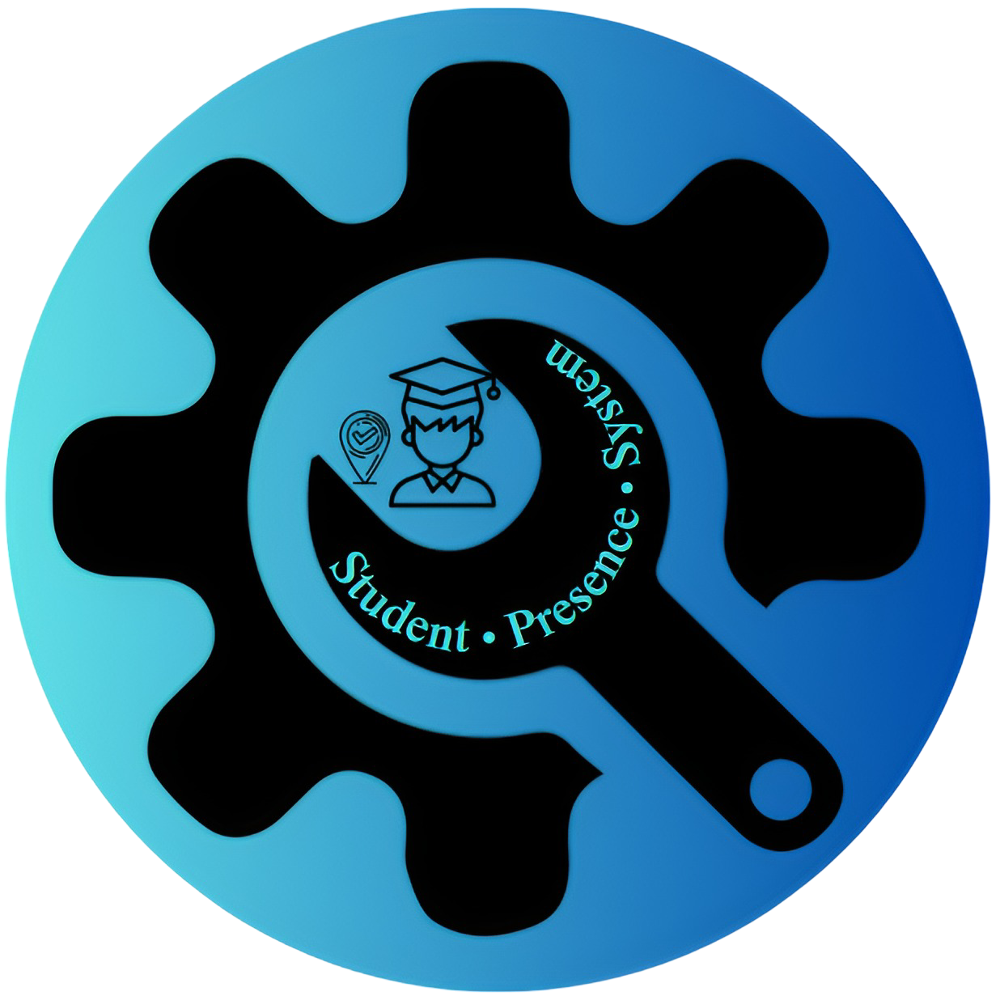

<table align="center">
  <tr>
    <td></td>
    <td><h1 style="font-size: 1.75em;">Student Attendance System</h1></td>
  </tr>
</table>

---

[](LICENSE)

## Project Overview

This is a Final Year Project (FYP) for the SMI department at "La Faculté Polydisciplinaire de Ouarzazate" - Ouarzazate - Morocco.

### Features

***This system includes four main functionalities:***

- **Student Data Import** — Upload a CSV file with student details (**CIN, Numero, Nom, Prenom**). Stored as `students.csv`.

- **CIN Card Processing** — Upload CIN card images. These are processed with OCR and regex to extract CIN numbers, saved in `cin_list.csv`.

- **Capture Card Feature** — Take real-time photos using your webcam. While it works well under good lighting and camera quality, OCR accuracy can drop in poor conditions.

- **Automated Attendance Tracking** — The system matches extracted CINs against the student list and generates `attendance.csv`, which is shown in the GUI.

---

## Project Code Installation

> [!TIP]
> **You can skip this if you already know how!**

To set up the project on a local machine, follow the steps below:

**Python Version :**

Compatible with:

```bash
Python 3.12.9
```

1. **Check your Python version before proceeding:**

- To check your Python version, you can run: 

```bash
python --version
```

- Or if you have multiple Python versions, you can use:

```bash
python3 --version
```

2. **Clone the repository:**

```bash
   git clone https://github.com/chaxyouxbraoui7/student-presence-system.git
```

3. **Navigate to the project directory:**

```bash
cd student-presence-system
```

4. **Create a virtual environment :**

```bash
python -m venv venv
```

5. **Activate the virtual environment:**

- On Windows:

```bash
.\venv\Scripts\activate
```

- On macOS/Linux:

```bash
source venv/bin/activate
```

6. **Upgrade pip (Important):**

```bash
python.exe -m pip install --upgrade pip
```

7. **Install the required dependencies:**

```bash
python -m pip install -r requirements.txt
```

**If the above fails, you can try:**

```bash
pip install --no-cache-dir -r requirements.txt
```

8. **Then finally run the system:**

```bash
python gui/main.py
```

---

> [!WARNING]
>
> ## Troubleshooting
> 
> - **Issue:** `pip install` doesn't work.
> 
>   **Solution:** Ensure your virtual environment is activated.
> 
> - **Issue:** Program won’t start.
> 
>   **Solution 1:** Check your Python version.
> 
>   **Solution 2:** Make sure you're in the project directory `cd .\student-presence-system\`.
> 
> - **Issue:** Dependencies won’t install.
> 
>   **Solution:** Try installing packages individually.

  ---

> [!NOTE]
>
> - The capture feature is faster and more automated, but only works reliably with a good camera and lighting setup.
>
> - For best OCR results, we highly recommend to upload high-quality, well-lit CIN card images.
>
> - Poor-quality images may lead to incorrect extractions.
> 
> - **Contributions are welcome!** Feel free to submit pull requests to improve this system, especially the *capture* functionality or any other enhancements.

---

# License

This project is licensed under the terms of the **Creative Commons Attribution-NonCommercial 4.0 International (CC BY-NC 4.0)** license.

- The project is intended **strictly for educational, academic, and personal learning purposes**.
- **Commercial use is not permitted** without explicit written permission from the author(s).
- If you modify or share this work, **you must provide proper credit and indicate changes**.

[View Full License Text](LICENSE) | [Learn More About CC BY-NC 4.0](https://creativecommons.org/licenses/by-nc/4.0/)